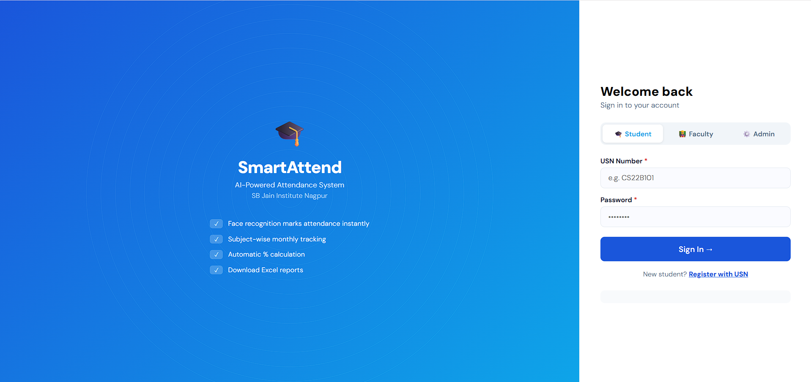
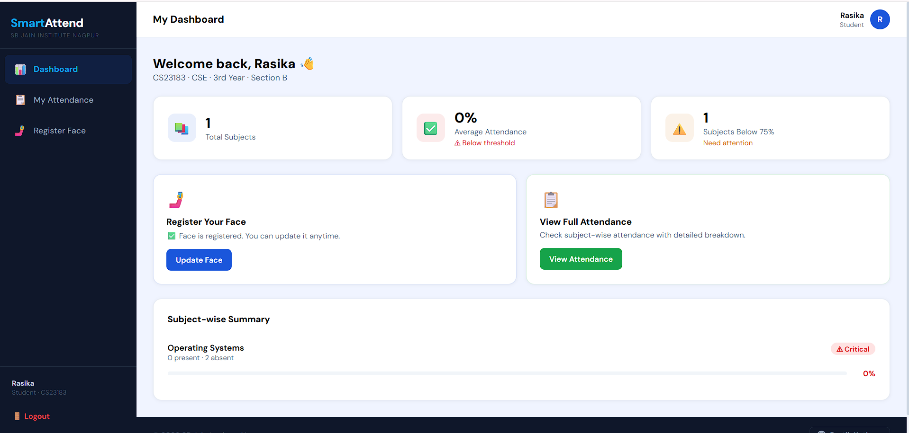
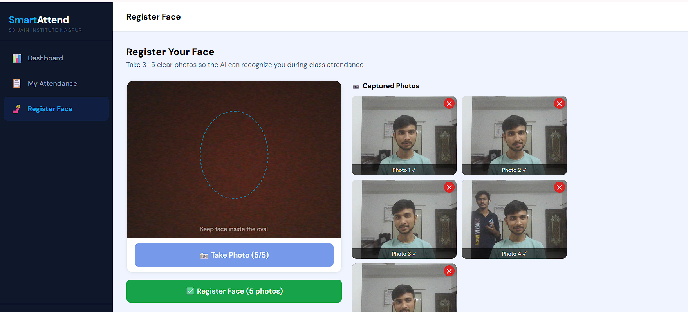
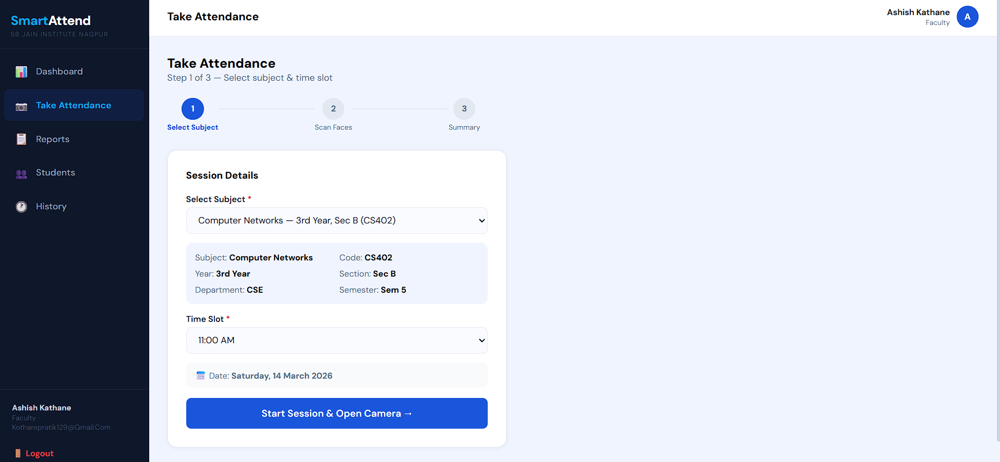
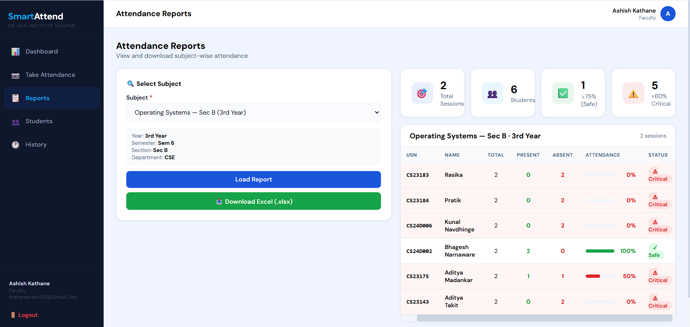

# 🧠 **SmartAttend AI** 
## AI-Powered **Face Recognition** Attendance System

[](https://smart-attendance-ai.vercel.app)
[](https://reactjs.org)
[](https://nodejs.org)
[](https://python.org)
[](https://mongodb.com)

**SmartAttend AI** is a cutting-edge, **cloud-native** attendance management system that leverages **DeepFace** with **FaceNet embeddings** for real-time, **contactless** student identification through webcam.

> **Precision**: 99%+ accuracy | **Speed**: <2s per scan | **Scale**: Unlimited students

## 🚀 **Live Demo**
👉 [**Launch Application**](https://smart-attendance-ai.vercel.app)

Fully hosted on **Vercel** (Frontend), **Render** (Backend/AI), **MongoDB Atlas** (Database). No setup required!

## 📱 **Screenshots**

| **Login** | **Student Dashboard** |
|-----------|-----------------------|
|  |  |

| **Face Registration** | **Live Attendance Scan** |
|------------------------|--------------------------|
|  |  |

| **Attendance Report** |
|----------------------|
|  |

## 🏗️ **System Architecture**

```
┌─────────────────┐     ┌──────────────────┐     ┌─────────────────┐
│   Student       │────▶│  Frontend        │────▶│   Backend API   │
│   Camera        │     │  (React/Vercel)  │     │ (Node/Render)   │
└─────────────────┘     └──────────────────┘     └─────────────────┘
                                                           │
                                            ┌─────────────────┐
                                            │  AI Service     │
                                            │ (FastAPI/Deep-  │
                                            │   Face/Render)  │
                                            └─────────────────┘
                                                           │
                                                ┌─────────────────┐
                                                │ MongoDB Atlas   │
                                                └─────────────────┘
```

## 🧬 **AI Recognition Pipeline**

1. **📸 Capture** face from webcam
2. **🔄 Encode** to Base64
3. **⚡ AI Service** receives image
4. **🧠 Detect** + extract **FaceNet embedding** (512-dim vector)
5. **🔍 Cosine similarity** vs stored embeddings
6. **✅ Match** if similarity > **0.85 threshold**
7. **✨ Mark** attendance in real-time

**No images stored** - only secure **embeddings**!

## 🛠️ **Tech Stack**

| Layer | Technologies |
|-------|--------------|
| **Frontend** | React, Axios, TailwindCSS, Vite |
| **Backend** | Node.js, Express, Mongoose, JWT |
| **AI/ML** | Python, **FastAPI**, **DeepFace**, **FaceNet**, TensorFlow |
| **Database** | **MongoDB** Atlas |
| **Deployment** | **Vercel**, **Render**, Railway |
| **Other** | OpenCV, Vercel AI SDK |

## 📂 **Project Structure**

```
smart-attendance-ai/
├── README.md                 # 📄 This file
├── vercel.json              # Vercel config
├── .gitignore
│
├── frontend/                 # React App
│   ├── package.json
│   ├── src/
│   │   ├── App.jsx
│   │   ├── pages/            # Dashboards, Login, etc.
│   │   ├── components/       # UI Components
│   │   └── context/
│   └── public/
│
├── backend/                  # Node.js API
│   ├── package.json
│   ├── server.js
│   ├── models/               # Mongoose Schemas
│   │   ├── Student.js
│   │   ├── User.js
│   │   ├── Attendance.js
│   │   └── AttendanceSession.js
│   ├── routes/               # API Routes
│   │   ├── auth.js
│   │   ├── students.js
│   │   ├── faculty.js
│   │   └── attendance.js
│   └── middleware/
│
├── ai-service/               # Python AI Microservice
│   ├── main.py              # FastAPI + DeepFace
│   ├── requirements.txt
│   ├── Procfile
│   └── runtime.txt
│
└── screenshots/              # 📸 Demo images
```

## ✨ **Key Features**

| Feature | Description |
|---------|-------------|
| **🤖 AI Attendance** | Automatic face recognition |
| **🔒 Secure Auth** | JWT + role-based access |
| **📊 Dashboards** | Student/Faculty views |
| **⚡ Real-time** | Live camera scanning |
| **☁️ Cloud-Native** | Zero-config deployment |
| **📈 Reports** | Session-wise analytics |
| **👤 Face Register** | Self-service enrollment |

## 🧪 **Local Setup**

### **Prerequisites**
- **Node.js** 18+ 
- **Python** 3.10+
- **MongoDB** (local or Atlas)
- **Git**

### **1. Clone & Install**
```bash
git clone <your-repo> smart-attendance-ai
cd smart-attendance-ai
```

### **2. Backend**
```cmd
cd backend
npm install
# Copy .env.example to .env, add MONGO_URI, JWT_SECRET
npm run dev
```
**Port**: 5000

### **3. Frontend**
```cmd
cd ..\frontend
npm install
npm run dev
```
**Port**: 3000

### **4. AI Service**
```cmd
cd ..\ai-service
pip install -r requirements.txt
uvicorn main:app --reload --port 8000
```

### **5. Database**
- Use **MongoDB Atlas** (recommended) or local MongoDB
- Run `node backend/seed.js` for sample data
- Update `.env` files with connection strings

### **6. Access**
- Frontend: http://localhost:3000
- Backend API: http://localhost:5000
- AI Service: http://localhost:8000

**Windows Note**: Use `cmd` or PowerShell. Install Python from python.org.

## 🔐 **Security**
- **Embeddings only** (no photos)
- **HTTPS enforced**
- **JWT tokens**
- **Rate limiting**
- **Input validation**

## 📈 **Future Roadmap**
- 🆕 **Liveness detection**
- 📱 **Mobile app**  
- 🎯 **Multi-face** batch attendance
- 📊 **Advanced analytics**
- 🚀 **GPU acceleration**

## 👨‍💻 **Author**
**Pratik Kothare**  
**Computer Science Student** | Full-Stack Developer

[](https://www.linkedin.com/in/pratik-kothare-99211628b/)
[](https://github.com/PratikKothare123)

⭐ **Star this repo if you found it useful!**

---

---

<p align="center">
  Built with ❤️ by <a href="https://www.instagram.com/pratik_kothare27/">Pratik Kothare</a> <br>
  <b>Computer Science Student</b>
</p>

